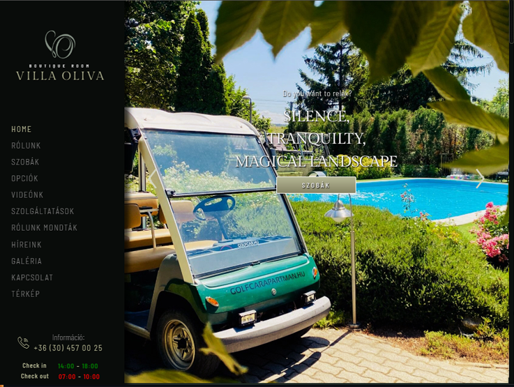

# [Villa-oliva](https://lebryere.github.io/Villa-oliva/)

## Browser Support

 |  |  |  |  | 
--- | --- | --- | --- | --- | --- |
94+ ✔ | 92+ ✔ | 89+ ✔ | 82+ ✔ | 87+ ✔ | 55+ ✔ |

## Preview

[](https://lebryere.github.io/Villa-oliva/)

**[View Live Preview](https://lebryere.github.io/Villa-oliva/)**

## Status

[](https://raw.githubusercontent.com/LeBryere/Villa-oliva/master/LICENSE).

## Usage

### Basic Usage


The inspiration for the site comes from the Villa-oliva.

### Variables
```css
/**************************************\
               bootstrap
\**************************************/
@import url("plugins/bootstrap.min.css");

/**************************************\
                 icons
\**************************************/
@import url("plugins/themify-icons.css");
@import url("plugins/flaticon.css");

/**************************************\
                selects
\**************************************/
@import url("plugins/flatpickr.css");
@import url("plugins/nice-select2.css");
```

## Copyright and License

Copyright 2024 Lebryere. Code released under the [](https://raw.githubusercontent.com/LeBryere/Villa-oliva/master/LICENSE).
